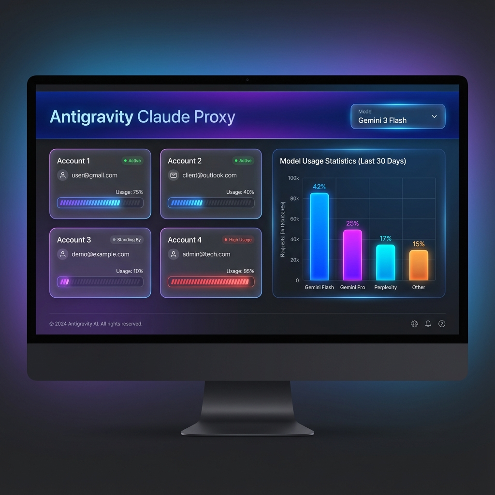
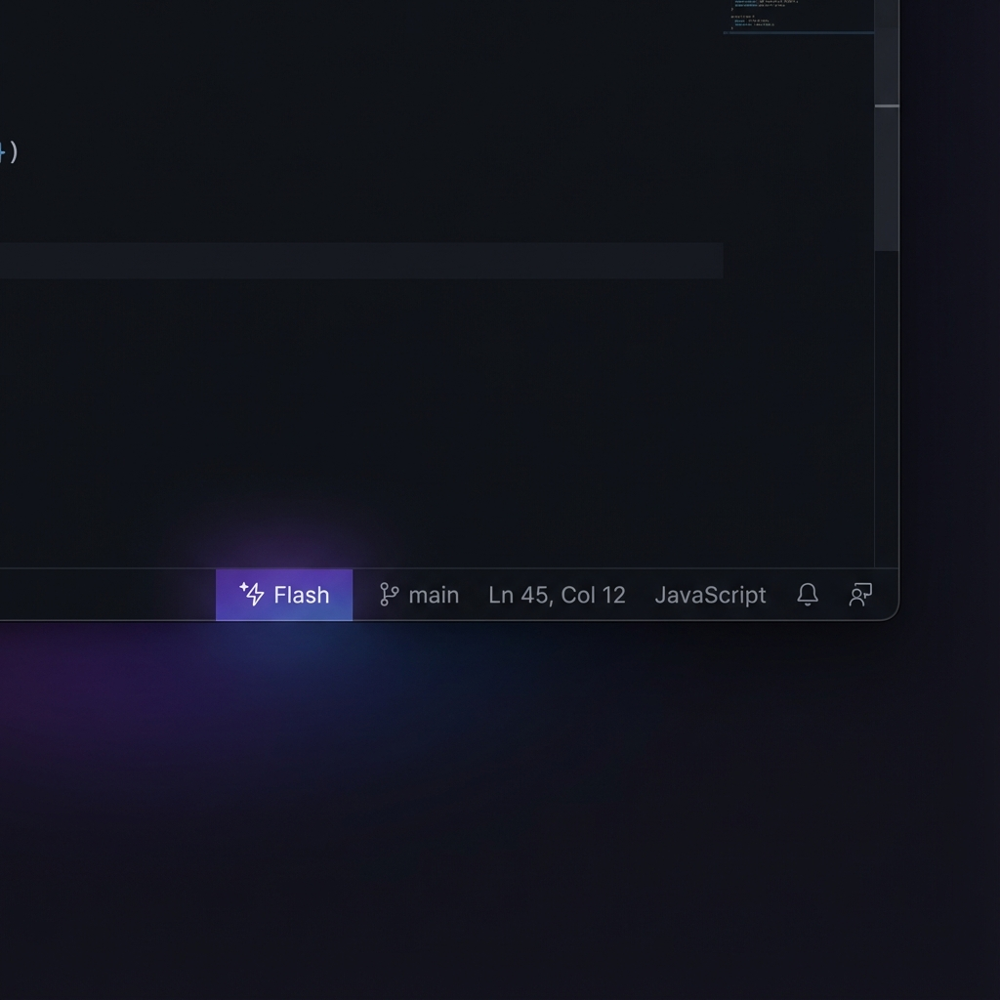

<p align="center">
  
  
  
  
</p>

<h1 align="center">🚀 Antigravity Claude Proxy v4.0</h1>

<p align="center">
  <strong>Use Claude Code CLI with Gemini, GPT-5, Grok, Claude, and 20+ AI models</strong>
  <br>
  <em>Multi-provider AI gateway with load balancing, status bar integration, and beautiful dashboard</em>
</p>

<p align="center">
  <a href="#-features">Features</a> •
  <a href="#-quick-start">Quick Start</a> •
  <a href="#-available-models">Models</a> •
  <a href="#-dashboard">Dashboard</a> •
  <a href="#-status-bar">Status Bar</a> •
  <a href="#-support">Support</a>
</p>

---

## 🖼️ Showcase

<p align="center">
  
  <br>
  <em>Beautiful dashboard with multi-account load balancing</em>
</p>

<p align="center">
  
  <br>
  <em>Real-time model status in VS Code status bar</em>
</p>

---

## ✨ Features

### 🎯 Core Capabilities

| Feature | Description |
|---------|-------------|
| **Multi-Provider Access** | Use 20+ AI models through one unified API |
| **Automatic Load Balancing** | Smart rotation across multiple accounts with cooldown management |
| **Auto-Start on Windows** | Proxy starts silently on login - always ready |
| **Beautiful Dashboard** | Real-time monitoring at `localhost:8080/dashboard` |
| **Streaming Support** | Real-time response streaming for all models |
| **Model Aliases** | Type `/model flash` instead of `/model gemini-3-flash` |
| **Smart Tool Fallback** | Auto-switches to capable models for agentic tasks |

### 🧠 Intelligent Features

- **⚡ Agentic Model Detection**: When you use a chat-only model (like Perplexity) for file operations, the proxy automatically switches to an agentic model
- **🔄 Rate Limit Recovery**: Accounts rotate automatically when rate-limited
- **📊 Per-Model Usage Tracking**: See exactly how many requests each model has handled
- **🎨 Extended Thinking Control**: Disabled by default for fast responses, enable for complex tasks

---

## 🏗️ Architecture

```
┌──────────────────┐     ┌─────────────────────────┐     ┌─────────────────────────┐
│                  │     │                         │     │                         │
│   Claude Code    │────▶│  Antigravity Proxy      │────▶│  Google AI (Antigravity) │
│   (any terminal) │     │  (localhost:8080)       │     │  gemini-3-flash, pro...  │
│                  │     │                         │     │                         │
└──────────────────┘     │  ┌─────────────────┐    │     ├─────────────────────────┤
                         │  │ Load Balancer   │    │     │                         │
                         │  │ Model Router    │    │────▶│  Perplexity Pro          │
                         │  │ Auto-Fallback   │    │     │  gpt-5, grok, kimi...    │
                         │  └─────────────────┘    │     │                         │
                         └─────────────────────────┘     └─────────────────────────┘
```

---

## 🚀 Quick Start

### Prerequisites

- **Node.js** 18+ 
- **Python** 3.10+ (for Perplexity models)
- **Antigravity** desktop app (for Google AI access)
- **Claude Code CLI** installed

### Installation

```bash
# Clone the repository
git clone https://github.com/ai-dev-2024/Claude-Cli-GoogleAiPro.git
cd Claude-Cli-GoogleAiPro/antigravity-claude-proxy-main

# Install dependencies
npm install

# Start the proxy
npm start
```

### Configure Claude Code

**Windows (PowerShell):**
```powershell
[System.Environment]::SetEnvironmentVariable("ANTHROPIC_BASE_URL", "http://localhost:8080", "User")
[System.Environment]::SetEnvironmentVariable("ANTHROPIC_API_KEY", "antigravity-proxy", "User")
```

**macOS/Linux:**
```bash
echo 'export ANTHROPIC_BASE_URL="http://localhost:8080"' >> ~/.bashrc
echo 'export ANTHROPIC_API_KEY="antigravity-proxy"' >> ~/.bashrc
source ~/.bashrc
```

### Start Using!

```bash
claude
```

---

## 🤖 Available Models

### ⚡ Agentic Models (Can Execute Tasks)

These models can run commands, edit files, and perform actions:

| Model ID | Alias | Best For |
|----------|-------|----------|
| `gemini-3-flash` | `flash` | Fast tasks, simple commands ⚡ |
| `gemini-3-pro-high` | `pro` | Complex coding, deep analysis |
| `gemini-2.5-flash` | - | Fast general use |
| `claude-opus-4-5-thinking` | `claude-opus` | Complex reasoning |
| `claude-sonnet-4-5-thinking` | `claude-sonnet` | Balanced performance |

### 🔍 Search Models (Q&A with Web Search)

These models provide web-augmented answers but cannot execute commands:

| Model ID | Alias | Description |
|----------|-------|-------------|
| `pplx-grok` | `grok` | Grok 4.1 with web search |
| `pplx-claude-opus` | `claude` | Claude Opus via Perplexity |
| `pplx-gpt51` | `gpt` | GPT-5.1 via Perplexity |
| `pplx-gpt52` | - | GPT-5.2 via Perplexity |
| `pplx-kimi` | `kimi` | Kimi K2 Thinking |
| `perplexity-auto` | `pplx` | Auto-select best model |
| `sonar`, `sonar-pro` | `search` | Perplexity Sonar search |

### 🎯 Quick Model Switch

```bash
/model flash    # Fast agentic work
/model pro      # Complex agentic work
/model grok     # Web search Q&A
```

> **Note:** If you use a search model for tasks requiring file operations, the proxy automatically switches to `gemini-3-flash` to prevent hallucinations.

---

## 📊 Dashboard

Access the beautiful dashboard at **http://localhost:8080/dashboard**

### Dashboard Features

| Page | Description |
|------|-------------|
| **📋 Overview** | All accounts at a glance with quick actions |
| **☁️ Google Usage** | Per-model quota tracking with visual bars |
| **🔮 Perplexity Usage** | Request counts and per-model statistics |
| **🩺 Health Status** | Real-time account availability monitoring |
| **📦 Available Models** | Complete list of all accessible models |

### Account Management

- **Add accounts** directly from the dashboard
- **Rename/Delete** accounts with one click
- **Real-time status** updates as you use the proxy

---

## 🔧 Auto-Start Setup (Windows)

The proxy can start automatically when Windows boots:

### Option 1: Hidden VBScript (Recommended)

A `start-proxy-hidden.vbs` script runs both servers completely hidden:

```vbscript
' Starts both Node.js and Python servers silently on startup
```

### Option 2: Startup Shortcut

1. Press `Win + R`, type `shell:startup`
2. Create a shortcut to `start-proxy-hidden.vbs`

### Option 3: PowerShell Profile

Add to your PowerShell profile (`$PROFILE`):

```powershell
$env:ANTHROPIC_BASE_URL = "http://localhost:8080"
$env:ANTHROPIC_API_KEY = "antigravity-proxy"
```

---

## 🖥️ VS Code Extension Integration (v3)

Use the proxy with Claude Code extension in Antigravity/VS Code:

### Configure settings.json

```json
{
  "anthropic.baseUrl": "http://localhost:8080",
  "anthropic.apiKey": "antigravity-proxy",
  "claudeCode.apiBaseUrl": "http://localhost:8080",
  "claudeCode.selectedModel": "gemini-3-flash",
  "claudeCode.environmentVariables": [
    { "name": "ANTHROPIC_BASE_URL", "value": "http://localhost:8080" },
    { "name": "ANTHROPIC_API_KEY", "value": "antigravity-proxy" },
    { "name": "ANTHROPIC_MODEL", "value": "gemini-3-flash" }
  ]
}
```

### How Model Selection Works

| Extension Dropdown | What Happens |
|-------------------|--------------|
| **Default/Opus/Haiku** | Model passes through directly to API (extension controls) |
| **Custom model** | Uses dashboard-selected model (dashboard controls) |

### Model Switching Methods

| Method | How | Scope |
|--------|-----|-------|
| **Dashboard** | http://localhost:8080/dashboard dropdown | Custom model |
| **Extension Dropdown** | Select Default/Opus/Haiku | Direct pass-through |
| **Natural Language** | Say "switch to grok" in chat | Custom model |
| **settings.json** | Edit `claudeCode.selectedModel` | Default on reload |

### ⚠️ Known Limitation: Extension UI

> **Note:** When you change the model via Dashboard, the extension's "Custom model" label in the dropdown doesn't update in real-time. This is a VS Code caching limitation.
>
> **The actual model DOES change** - only the UI label stays stale until you restart Antigravity.

### Quick Switch via Dashboard

Open http://localhost:8080/dashboard and use the model dropdown in the header.

---

## 📊 Status Bar (v4.0)

The enhanced `claude-proxy-status` extension shows the current model in your status bar:

| Icon | Model |
|------|-------|
| ⚡ Flash | gemini-3-flash |
| 💎 Pro | gemini-3-pro-high |
| 🎭 Opus | claude-opus-* |
| 🎵 Sonnet | claude-sonnet-* |
| 🌐 Grok | pplx-grok |
| 🔍 Perplexity | pplx-*, sonar |

### Features:
- **Real-time updates** - Polls every 3 seconds
- **Click to open** - Opens dashboard on click
- **Model change notification** - Toast when model changes

---

## 🔌 API Endpoints

| Endpoint | Method | Description |
|----------|--------|-------------|
| `/health` | GET | Health check with account status |
| `/v1/messages` | POST | Anthropic Messages API (compatible) |
| `/v1/models` | GET | List all available models |
| `/dashboard` | GET | Web dashboard |
| `/account-limits` | GET | Detailed account quotas |
| `/active-model` | GET | Get current active model |
| `/active-model` | POST | Set global model override |
| `/active-model` | DELETE | Clear model override |
| `/perplexity-sessions` | GET/POST | Manage Perplexity accounts |
| `/google-accounts/:email` | DELETE | Remove Google account |

---

## 📁 Project Structure

```
Claude-Cli-GoogleAiPro/
├── antigravity-claude-proxy-main/
│   ├── src/
│   │   ├── server.js              # Main Express server
│   │   ├── account-manager.js     # Google account handling
│   │   ├── constants.js           # Model aliases & config
│   │   ├── perplexity-session.js  # Perplexity integration
│   │   └── public/
│   │       └── dashboard.html     # Web dashboard UI
│   └── package.json
│
├── perplexity-openai-api-ref/     # Perplexity Python server
│   ├── openai_server.py           # FastAPI server
│   └── src/perplexity_webui_scraper/
│
├── start-proxy.bat                # Windows startup script
├── start-proxy-hidden.vbs         # Silent startup script
└── antigravity-profile.ps1        # PowerShell profile additions
```

---

## 🔒 Security Notes

- **No API keys stored**: Uses OAuth for Google AI, session tokens for Perplexity
- **Local-only by default**: Server binds to `localhost:8080`
- **Sensitive files excluded**: `.env`, tokens, and sessions are gitignored
- **Personal use**: Designed for individual developer use

---

## ❓ Troubleshooting

<details>
<summary><strong>Proxy won't start</strong></summary>

- Check if ports 8080 and 8000 are available
- Verify Node.js 18+ is installed: `node --version`
- Check Python 3.10+ for Perplexity: `python --version`

</details>

<details>
<summary><strong>404 errors from models</strong></summary>

- Make sure Antigravity desktop app is running
- Try refreshing tokens via Dashboard → Health Status
- Check if your account has Cloud Code access

</details>

<details>
<summary><strong>Perplexity models not working</strong></summary>

- Ensure Python server is running on port 8000
- Re-login via Dashboard → Perplexity Usage → Add Account
- Check if you have Perplexity Pro subscription

</details>

<details>
<summary><strong>Slow responses</strong></summary>

- Use `/model flash` for fast responses (no extended thinking)
- Check Dashboard for rate-limited accounts
- Add more accounts for better load distribution

</details>

---

## 💖 Support

If you find this project useful, consider supporting its development:

<p align="center">
  <a href="https://buymeacoffee.com/muhib">
    
  </a>
</p>

---

## 📜 License

MIT License - See [LICENSE](LICENSE) for details.

---

## 🙏 Credits

Built with contributions from the open-source community:

- [antigravity-claude-proxy](https://github.com/badri-s2001/antigravity-claude-proxy) - Original proxy implementation
- [perplexity-openai-api-ref](https://github.com/artp1ay/perplexity-openai-api-ref) - Perplexity API integration

---

<p align="center">
  <strong>Made with ❤️ for the AI developer community</strong>
</p>