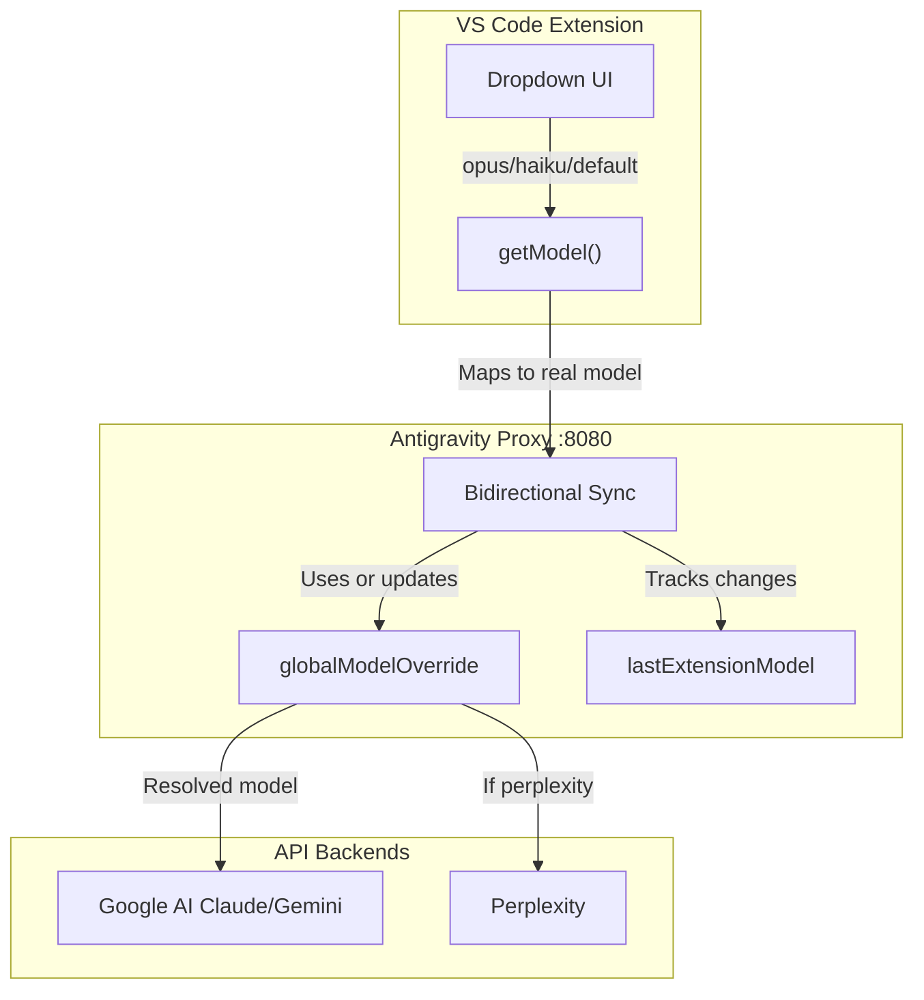

# Antigravity Claude Proxy - Version 3.0
## Extension Model Mapping + Smart Bidirectional Sync

**Date:** 2026-01-01
**Status:** ✅ Complete and Working

---

## What's Working

### Extension Dropdown Model Mapping
| Dropdown | Routes To |
|----------|-----------|
| Default | `claude-sonnet-4-5-thinking` |
| Opus | `claude-opus-4-5-thinking` |
| Haiku | `gemini-3-flash` |
| Custom | Passthrough (any model) |

### Smart Bidirectional Sync
| Action | Result |
|--------|--------|
| Dashboard model change | Persists, used for all requests |
| Extension sends same model | Dashboard model still used |
| Extension sends NEW model | Overrides dashboard |

---

## Architecture



---

## Key Files Modified

### 1. Extension: `extension.js` (Line 43860)
```javascript
getModel() {
    let e = mr("selectedModel");
    // Antigravity Proxy Model Mapping
    if (!e || e === "default" || e === "sonnet") return "claude-sonnet-4-5-thinking";
    if (e === "opus") return "claude-opus-4-5-thinking";
    if (e === "haiku") return "gemini-3-flash";
    return e;
}
```

### 2. Proxy: `server.js` (Lines 82, 933-955)
- Added `lastExtensionModel` tracking variable
- Smart sync: Dashboard priority, extension can override with NEW selection

---

## Files in This Version

| File | Description |
|------|-------------|
| `extension.js.original` | Original extension (backup) |
| `extension.js.beautified` | Beautified 56K lines |
| `extension.js.modified` | With model mapping |
| `extension.js.minified` | Installed version |

---

## Verification

**Proxy Logs Confirm:**
```
[REQUEST] Model: gemini-3-pro-high | Source: dashboard-override
[REQUEST] Model: gemini-3-flash | Source: dashboard-override
```

**User Tests Passed:**
- ✅ Dashboard → gemini-3-pro-high
- ✅ Extension Haiku → gemini-3-flash
- ✅ Extension Opus → claude-opus-4-5-thinking
- ✅ Extension Default → claude-sonnet-4-5-thinking

---

## Rollback

```powershell
# Restore original extension
Copy-Item "versions\v3-extension-modification\extension.js.original" `
  -Destination "C:\Users\Muhib\.vscode\extensions\anthropic.claude-code-2.0.75-win32-x64\extension.js"
```
